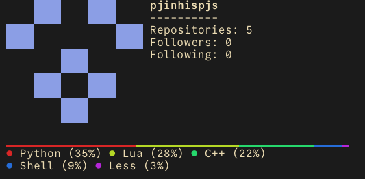

# ghfetch



A CLI tool to fetch and display GitHub user information in a "fetch" style, inspired by neofetch.

## Features

- **Identicon**: Renders the user's GitHub identicon in the terminal.
- **User Info**: Displays name, bio, location, repositories, followers, and more.
- **Language Stats**: Shows a color-coded bar chart of the user's most used languages across all repositories.

## Installation

Ensure you have Python 3 and the `requests` library installed:

```bash
pip install requests
```

## Usage

Run the script followed by a GitHub username:

```bash
python3 ghfetch.py <username>
```

Example:
```bash
python3 ghfetch.py octocat
```
